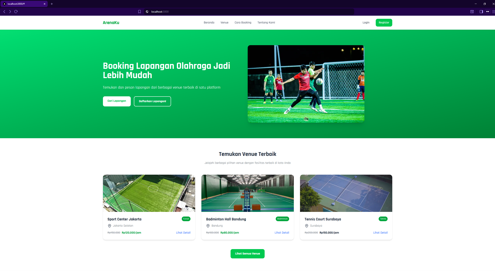

# ⚽ ArenaKu

A modern **sports field booking platform** built with **Next.js** and **TypeScript**.  
This project was developed as a **personal learning project** to explore full-stack web development concepts, focusing on **real-world booking systems**, **database modeling**, and **payment integration**.


For full documentation including images and videos, you can visit my portfolio:  
[Click Me!](https://portfolio-adnanalvito.vercel.app/projects/1)

---

## ✨ Description

**ArenaKu** allows users to browse available sports venues, view real-time schedules, and book fields online.  
It’s designed with scalability in mind — initially for one owner (me), but the database structure already supports **multi-owner functionality** in the future.

The main goal of this project is to **learn and apply modern web development practices** using Next.js and TypeScript while simulating a realistic SaaS-like platform architecture.

---

## ⚙️ Key Features

- 🏐 Browse and book available sports fields  
- 📅 Dynamic time slot management with real-time updates  
- 💳 Payment integration using **Midtrans**  
- 🧾 Admin dashboard for managing venues and schedules  
- 🧍 Role-based authentication for owners and customers  
- 🧱 PostgreSQL + Prisma schema design ready for multi-owner expansion  
- 🎨 Clean and responsive UI built with Tailwind CSS  

---

## 🧰 Tech Stack


---

## 🧩 Project Goals

This project was created primarily for **learning purposes**, focusing on:
- Understanding **Next.js** structure and server-side rendering (SSR)
- Writing strongly typed code with **TypeScript**
- Building responsive UIs with **Tailwind CSS**
- Implementing a **PostgreSQL + Prisma** database
- Preparing for **Midtrans payment gateway** integration
- Practicing clean and modular code architecture  

---

## 🚀 Getting Started

### 1️⃣ Clone the repository
```bash
git clone https://github.com/SiEncan/ArenaKu.git
cd ArenaKu
```

### 2️⃣ Install dependencies
```bash
npm install
```

### 3️⃣ Set up environment variables
```bash
Create a .env file and fill in your credentials:

DATABASE_URL="your_postgresql_connection"
NEXT_PUBLIC_MIDTRANS_CLIENT_KEY="your_midtrans_client_key"
MIDTRANS_SERVER_KEY="your_midtrans_server_key"
```

### 4️⃣ Run the development server
```bash
npm run dev
```
